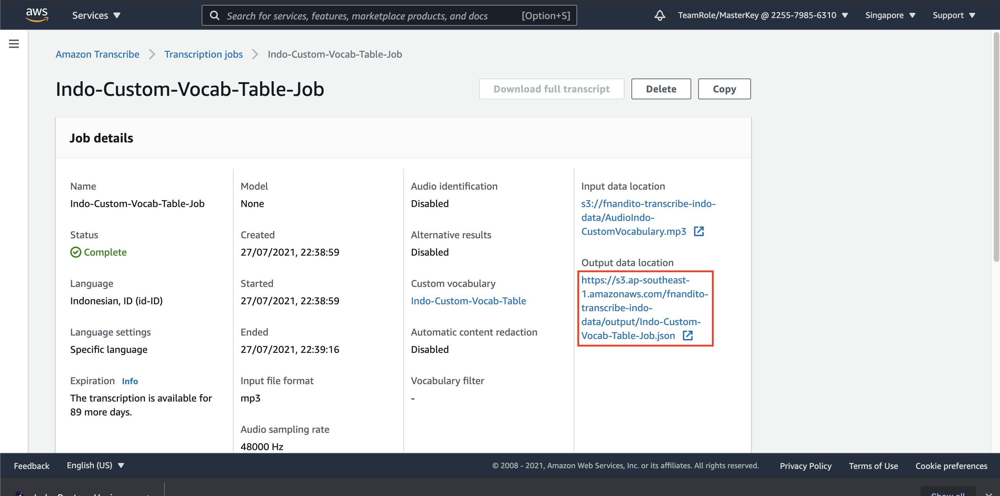

## Using Custom Vocabulary on Amazon Transcribe

Custom Vocabulary helps to increase the accuracy for speech-to-text prediction, by specifying how does the word would like to be shown. There are 2 ways to do so, by using `List` format (Only by uploading file, or by using `Table` format. Please refer to [this Documentation](https://docs.aws.amazon.com/transcribe/latest/dg/how-vocabulary.html) for Custom Vocabulary.

1. go to [Transcribe Console](https://ap-southeast-1.console.aws.amazon.com/transcribe/home?region=ap-southeast-1)
2. click `Custom Vocabulary` on the left menu
3. click `Create Vocabulary`

Let's try to use List format first.

4. on name, fill it with `Indo-Custom-Vocab-List`
5. in Language, choose `Indonesian` Language
6. on vocabulary input mode, choose `File Upload` radio button.
7. click `Choose File` button
8. upload your `CustomVocabListIndo.txt` file

As mentioned above, list format is only for file upload input source.

9. click `Create Vocabulary`

Now, let's try to make other vocabulary using `Table` format.

10. in `Custom Vocabulary` menu, click `Create Vocabulary` again.

11. on name, fill it with `Indo-Custom-Vocab-Table`
12. in Language, choose `Indonesian` Language
13. on vocabulary input mode, choose `S3 location` radio button.
14. click `Browse S3`

15. click your bucket name `<yourname>-transcribe-indo-data`, and choose `CustomVocabTableIndo.txt`, and click `Choose`

The limit for custom vocabulary file is 50 KB. this CAN'T BE INCREASED (HARD LIMIT). Table mode is only available for S3 input source.

16. click `Create Vocabulary`

give it around 3 minutes to run the custom vocabulary for both types.

once it's ready, it will give the status `Ready`

Now, we can run a job using this vocabulary.

17. click the radio button besides `Indo-Custom-Vocab-List` and click `Create Job`

18. on specify job details page, fill the name with `Indo-Custom-Vocab-List-Job`
19. on model type, choose `General model`
20. in language settings, choose `Specific Language` and choose Indonesian Language.

21. for input data, click `Browse S3`
22. click your bucket name, and choose file `AudioIndo-CustomVocabulary.mp3`, and click `Choose`

23. for output data, choose `Customer specified S3 bucket`
24. click `Browse S3`
25. click your bucket name, and click radio button on folder `Output` and click `Choose`

26. click `Next`
27. on customization, make sure the `Custom vocabulary` is on, with `Indo-Custom-Vocab-List` choosen.
28. click `Create Job`

Let's do the same with Table format.

29. go to custom vocabulary menu, and choose `Indo-Custom-Vocab-Table` radio button, and choose `Create job`

30. on specify job details page, fill the name with `Indo-Custom-Vocab-Table-Job`
31. on model type, choose `General model`
32. in language settings, choose `Specific Language` and choose Indonesian Language.

33. for input data, click `Browse S3`
34. click your bucket name, and choose file `AudioIndo-CustomVocabulary.mp3`, and click `Choose`

35. for output data, choose `Customer specified S3 bucket`
36. click `Browse S3`
37. click your bucket name, and click radio button on folder `Output` and click `Choose`

38. click `Next`
39. on customization, make sure the `Custom vocabulary` is on, with `Indo-Custom-Vocab-List` choosen.
40. click `Create Job`

give the job around 3 minutes to transcribe the audio.

Once it's done, let's check the result.

41. click `Transcription Job` menu, and click the `Indo-Custom-Vocab-List-Job` name

42. click the output data location link, it will open new tab

43. click `donwload` button.

44. open your json file using your text editor (I'm using VS Code). To make the json file looks better, click `Shift + Option + F` (Mac user), click `Shift + Alt + F` (Windows), click `Ctrl + Shift + l` (Linux)

as you see, there will be `Transcript` part on JSON. on the list format, it will capslock the word `wawancara` and `anda`. Let's check the table format vocabulary.

45. go to [Transcribe Console](https://ap-southeast-1.console.aws.amazon.com/transcribe/home?region=ap-southeast-1)
46. in Transcription job menu, click `Indo-Custom-Vocab-Table-Job`

47. click the output data location link, it will open new tab

48. click `donwload` button.

49. open your json file using your text editor (I'm using VS Code). To make the json file looks better, click `Shift + Option + F` (Mac user), click `Shift + Alt + F` (Windows), click `Ctrl + Shift + l` (Linux)

on the table format, it will capslock the word `wawancara` and `anda`. it's also changing the word `wawancara` into `WACANA`. This is just an example of it.

[BACK TO WORKSHOP GUIDE :house:](../README.md)

[CONTINUE TO NEXT GUIDE :arrow_right:](VocabFilter.md)

[BACK TO PREVIOUS GUIDE :arrow_left:](Transcribe.md)