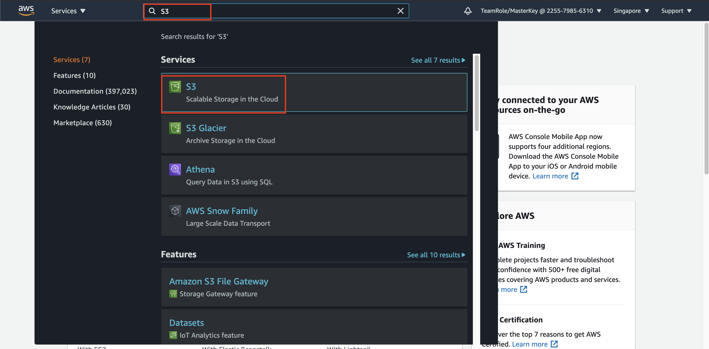
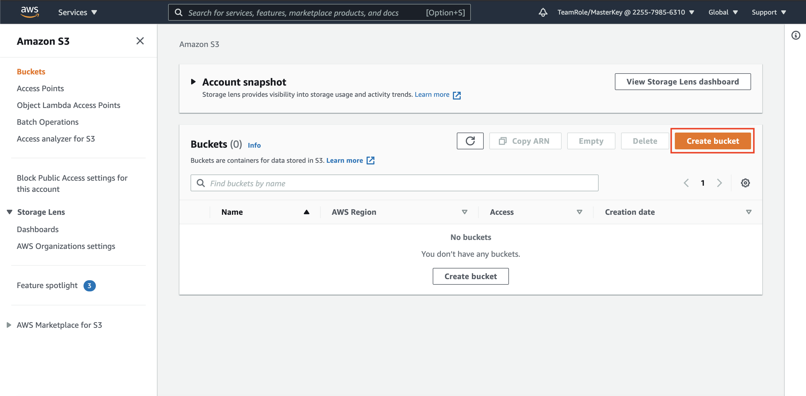
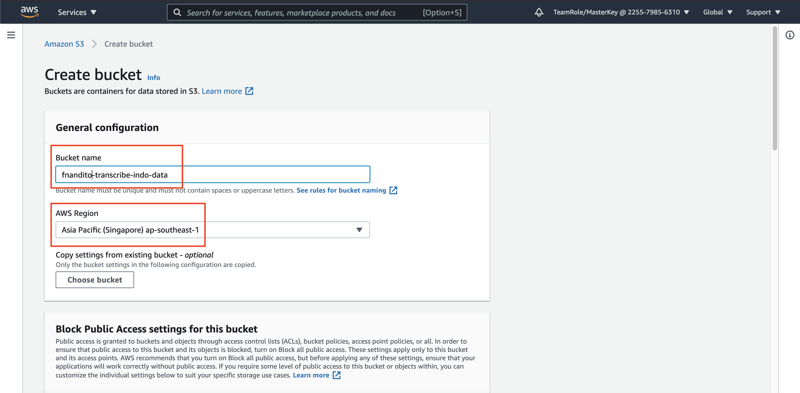
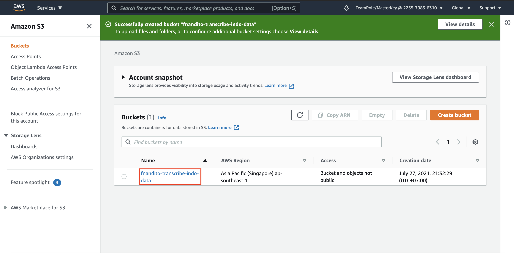
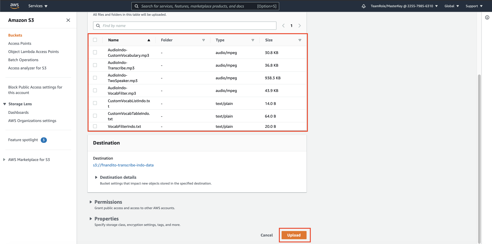

## Data Source Configuration

The data is in mp3 format for Indonesian Speech. We are going to convert the audio speech into text.

1. Please download this [Supported Files](../files/SupportedFiles.zip) (please click `open in new tab` on the link, and click `download` button). Unzip it once you are done.
2. Alternatively, if you can't unzip files, here are lists of files that we are going to use:

[Audio Transcribe](../files/AudioIndo-Transcribe.mp3)

[Audio Custom Vocabulary](../files/AudioIndo-CustomVocabulary.mp3)

[Audio Vocabulary Filter](../files/AudioIndo-VocabFilter.mp3)

[Audio Two Speakers](../files/AudioIndo-TwoSpeaker.mp3)

[Custom Vocabulary List Format Rule](../files/CustomVocabListIndo.txt)

[Custom Vocabulary Table Format Rule](../files/CustomVocabTableIndo.txt)

[Vocabulary Filter Rule](../files/VocabFilterIndo.txt)

(open in new tab on the link, click `raw` and click `save as`, choose the format into `All Files`, and remove the `.txt` extension at the end of the file name)

3. go to [AWS Console](https://ap-southeast-1.console.aws.amazon.com/console/home?region=ap-southeast-1)
4. type `S3` at the search bar, and click the `S3` service.

5. Or, you can click [this link to S3 Console](https://s3.console.aws.amazon.com/s3/home?region=ap-southeast-1#)
6. in S3 Console, click `Create Bucket`

7. fill your bucket name with `<yourname>-transcribe-indo-data`

Bear in mind that each of the bucket names in S3 must be unique, so if your 1st time doesn't work, please change the name.

8. Specify the region to `Singapore`

9. scroll down and click `Create Bucket`

Once the storage is ready, we are going to upload it.

10. click your bucket name `<yourname>-transcribe-indo-data`

First, we are going to upload the unlabelled data, for sagemaker ground truth.

11. click `Upload`
12. upload all files by drag and drop to the console, or you can click `Add files`
13. click `Upload` and click `Close` once it's done.

[BACK TO WORKSHOP GUIDE :house:](../README.md)

[CONTINUE TO NEXT GUIDE :arrow_right:](Transcribe.md)