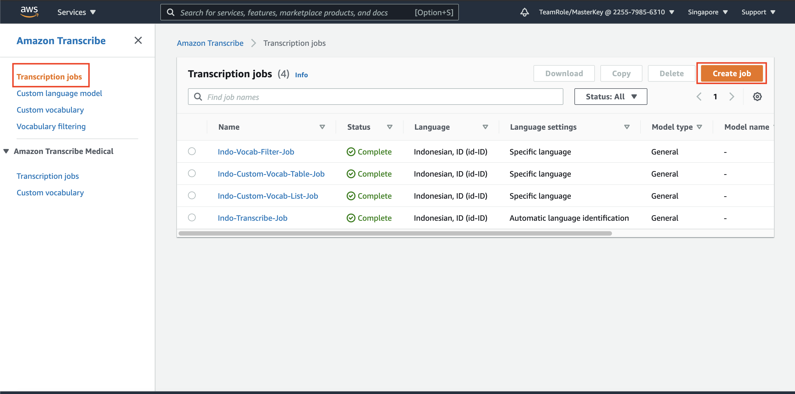
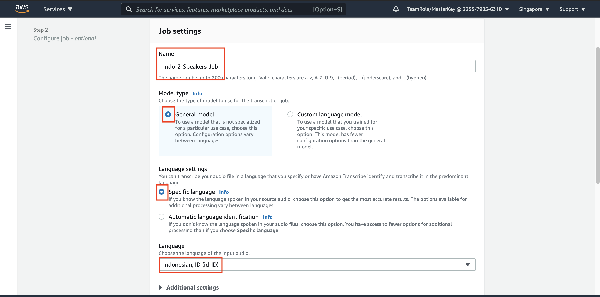
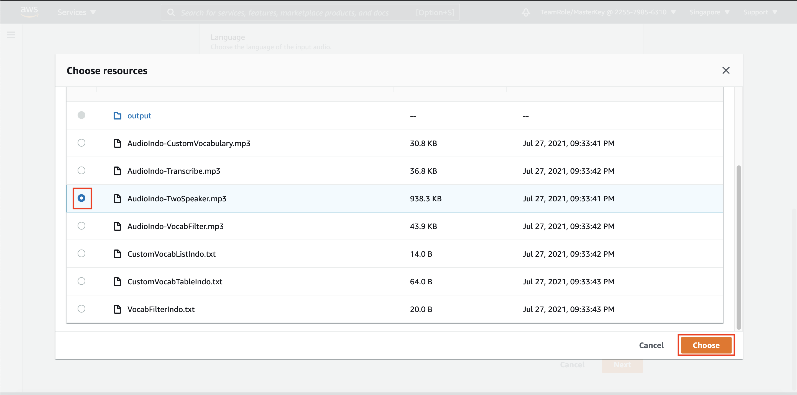
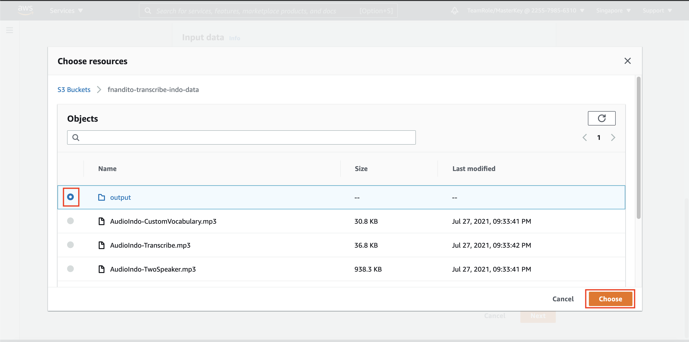
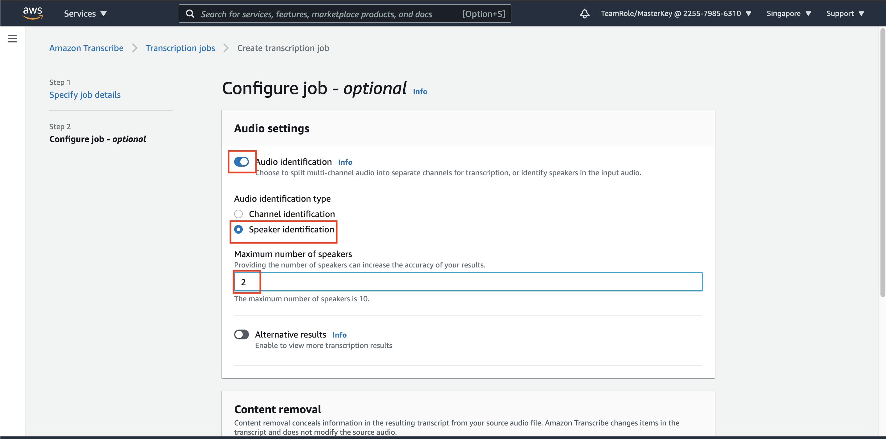
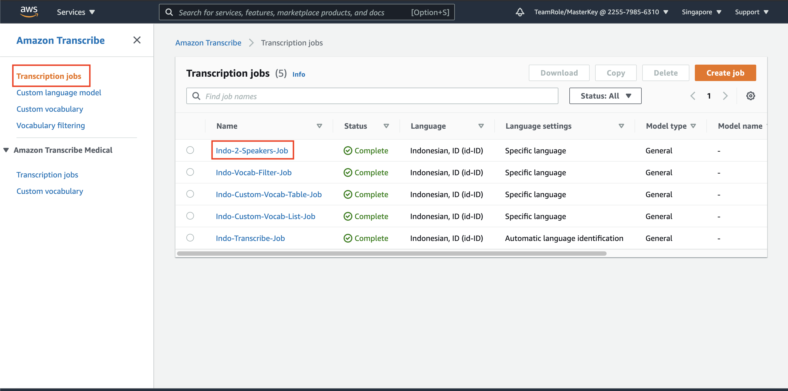
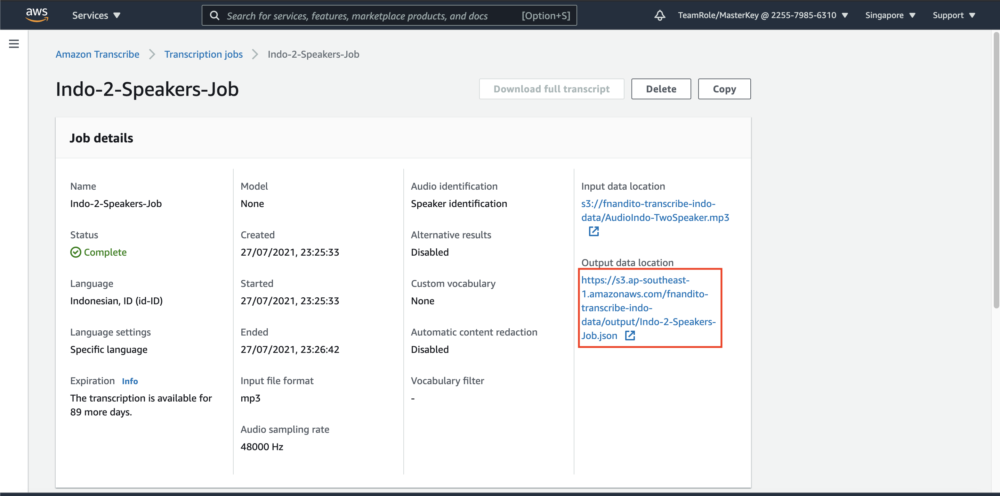
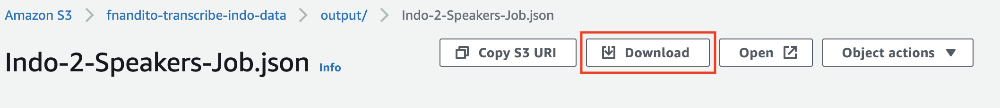
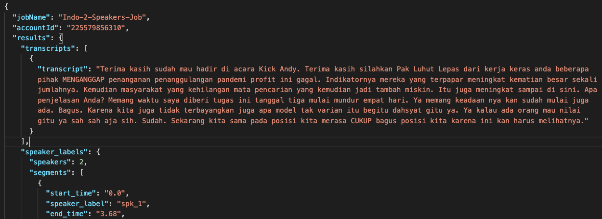

## Using Speaker Identification (speaker diarization) on Amazon Transcribe

Amazon Transcribe has a capability to detect at which seconds does the speaker changed during conversation. You can specify up to 10 speakers per audio. This helps to increase the accuracy result. For more information, please refer to [this documentation](https://docs.aws.amazon.com/transcribe/latest/dg/diarization.html)

1. go to [Transcribe Console](https://ap-southeast-1.console.aws.amazon.com/transcribe/home?region=ap-southeast-1)
2. in `Transcription job` menu, click `Create job` on Transcription Job

3. in Job settings, specify the name with `Indo-2-Speakers-Job`
4. for model type, use `General model`
5. in language settings, choose `Specific Language` and choose Indonesian Language.

6. in input data, click `Browse S3`
7. click your bucket name, choose the file `AudioIndo-TwoSpeaker.mp3` and click `Choose`

9. for Output data, choose `Customer specified S3 bucket`
10. click `Browse S3`
11. click your bucket name, and click radio button on folder `Output` and click `Choose`

12. click `Next`
13. turn on `Audio identification`
14. choose `Speaker Identification`
15. specify the maximum number of speakers to `2`

16. click `Create Job`

please give around 3 minutes to run the job.

once it's done, let's open the result.

17. click `Transcription Job` menu, and click the `Indo-2-Speakers-Job` name

18. click the output data location link, it will open new tab

19. click `donwload` button.

20. open your json file using your text editor (I'm using VS Code). To make the json file looks better, click `Shift + Option + F` (Mac user), click `Shift + Alt + F` (Windows), click `Ctrl + Shift + l` (Linux)

as you can see, there will be 2 speakers on the result. if you check the full outputs, there will be a time when the speaker changed, from `spk_0` to `spk_1`, and vice versa. `spk_1` talks for quite long duration, until it changes to `spk_0` in seconds 32 (based on start_time)

[BACK TO WORKSHOP GUIDE :house:](../README.md)

[CONTINUE TO NEXT GUIDE :arrow_right:](A2I.md)

[BACK TO PREVIOUS GUIDE :arrow_left:](VocabFilter.md)