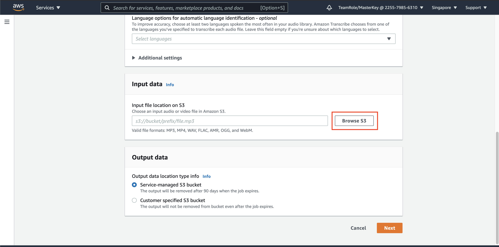

## Speech-to-text on Amazon Transcribe

Now, let's try to transcribe the audio file.

1. go to [Transcribe Console](https://ap-southeast-1.console.aws.amazon.com/transcribe/home?region=ap-southeast-1)
2. in `Transcription job` menu, click `Create job` on Transcription Job

3. in Job settings, specify the name with `Indo-Transcribe-Job`
4. for model type, use `General model`
5. for language settings, choose `Automatic language identification`

this will be automatically detect which language does the audio come from.

6. in input data, click `Browse S3`

7. click your bucket name with format `<yourname>-transcribe-indo-data`
8. choose the file `AudiIndo-Transcribe.mp3` and click `Choose`

9. for Output data, choose `Customer specified S3 bucket`
10. same with previous step, click `Browse S3`
11. choose your S3 bucket and click `Choose`

12. in the output file destination, please add string `/output/` behind your S3 bucket name. This step will create `output` folder automatically on our S3 bucket.

13. click `Next`

14. in configure job, click `Create Job`

This will take around 3 minutes to be processed.

Once it's done, it will create json file on specified S3 bucket

15. click the job name `Indo-Transcribe-Job`
16. click `Output Data Location` link

it will open new tab, referring to your S3 bucket.

17. download your json file, by clicking `Download` button

18. open your json file using your text editor (I'm using VS Code). To make the json file looks better, click `Shift + Option + F` (Mac user), click `Shift + Alt + F` (Windows), click `Ctrl + Shift + l` (Linux)

As you can see, the language is being automatically defined as Indonesian Language, with confidence of 57%. Since Malay language is quite similar, it's expected to also be detected as malay language. To ensure this as indonesian language, specify the language on the job to `Indonesian` language, or other languages you would like to use.

[BACK TO WORKSHOP GUIDE :house:](../README.md)

[CONTINUE TO NEXT GUIDE :arrow_right:](CustomVocab.md)

[BACK TO PREVIOUS GUIDE :arrow_left:](DataSource.md)