## Using Vocabulary Filtering on Amazon Transcribe

vocab filter helps to censor some of the speech contents when it goes to text. there are 3 ways, using mask (***), remove the text, or using tag. Usually being used to censor the swear words that shouldn't be displayed. Please follow [this documentation](https://docs.aws.amazon.com/transcribe/latest/dg/filter-unwanted-words.html) for more information.

1. go to [Transcribe Console](https://ap-southeast-1.console.aws.amazon.com/transcribe/home?region=ap-southeast-1)
2. click `Vocabulary Filtering` on the left menu
3. click `Create Vocabulary filter`

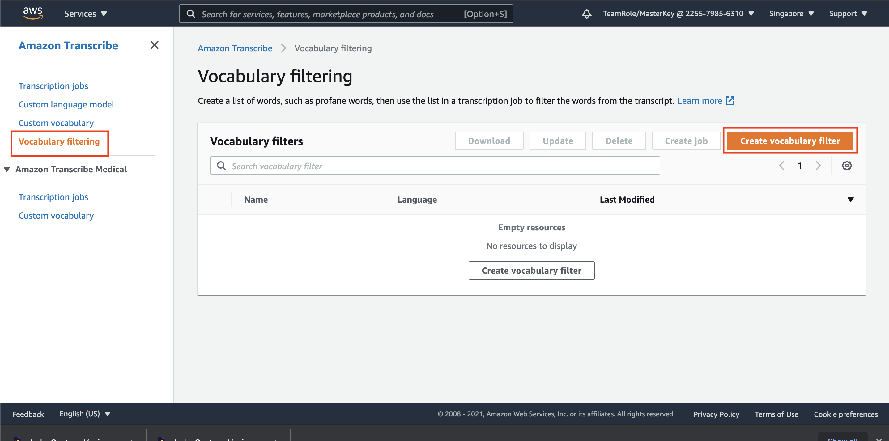

4. on name, fill it with `Indo-Vocab-Filter-List`
5. in Language, choose `Indonesian` Language
6. on vocabulary input source, choose `S3 location` radio button.
7. click `Browse S3` button
8. click your bucket name, and choose `VocabFilterIndo.txt` file, and click `Choose`

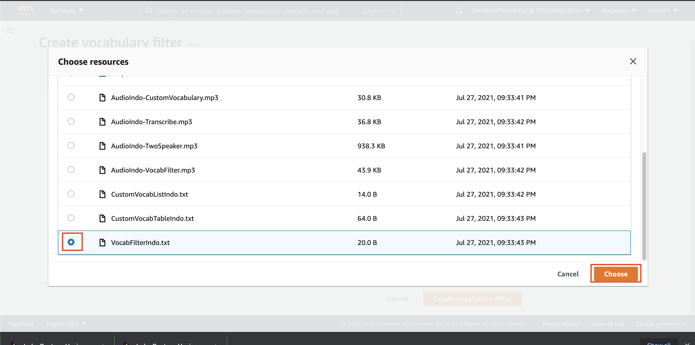

9. click `Create vocabulary Filter`

it can be used automatically without waiting. Let's try to censor some of the words.

10. on vocabulary filtering menu, click the radio button besides `Indo-Vocab-Filter-List` and click `Create Job`

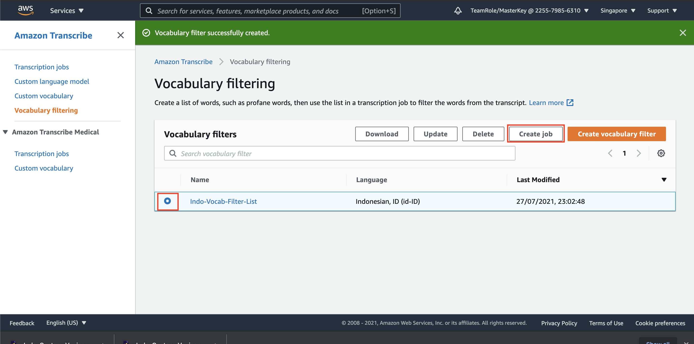

11. on specify job details page, fill the name with `Indo-Vocab-Filter-Job`
12. on model type, choose `General model`
13. in language settings, choose `Specific Language` and choose Indonesian Language.

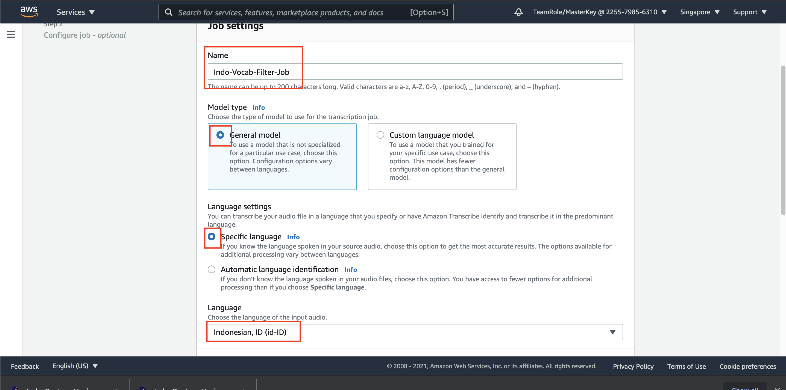

14. for input data, click `Browse S3`
15. click your bucket name, and choose file `AudioIndo-VocabFilter.mp3`, and click `Choose`

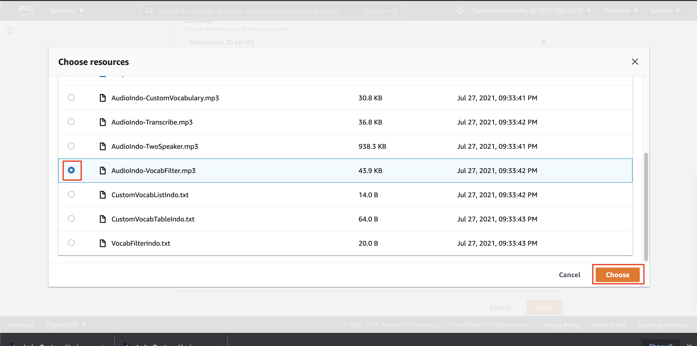

16. for output data, choose `Customer specified S3 bucket`
17. click `Browse S3`
18. click your bucket name, and click radio button on folder `Output` and click `Choose`

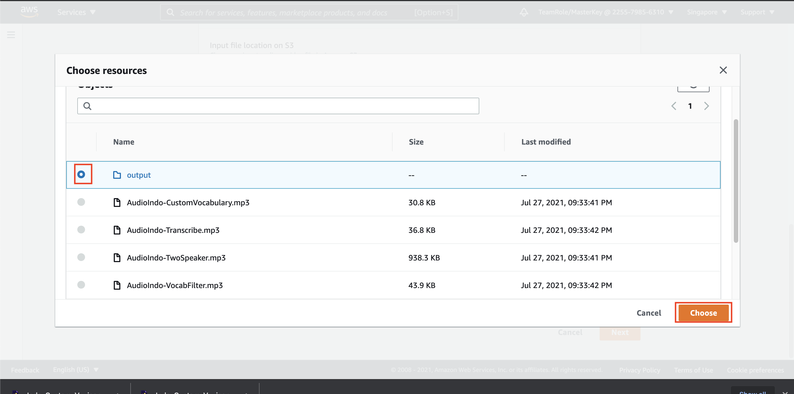

19. click `Next`
20. on customization, make sure the `Vocabulary Filtering` is on, with `Indo-Custom-Vocab-List` choosen, and use `Mask vocabulary`.

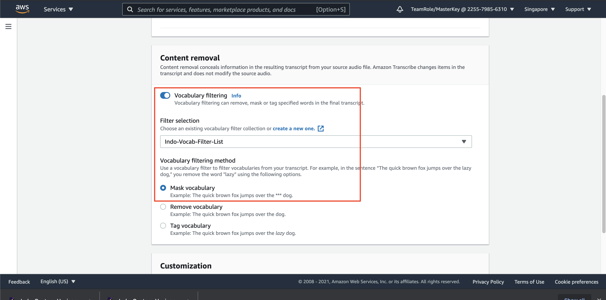

21. click `Create Job`

give it around 3 minutes to run the job. Once it's done, let's check it.

22. in transcription job menu, click `Indo-Vocab-Filter-Job` name.

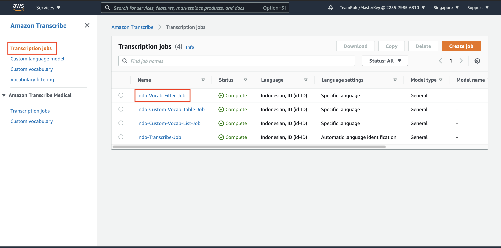

23. click the output data location link, it will open new tab

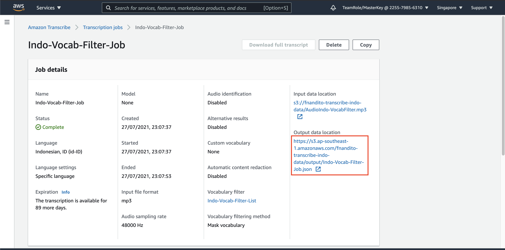

24. click `donwload` button.

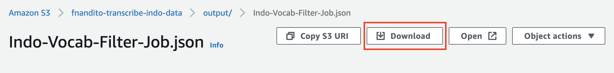

25. open your json file using your text editor. For mac user, to make the json file looks better, click `Shift + Option + F`

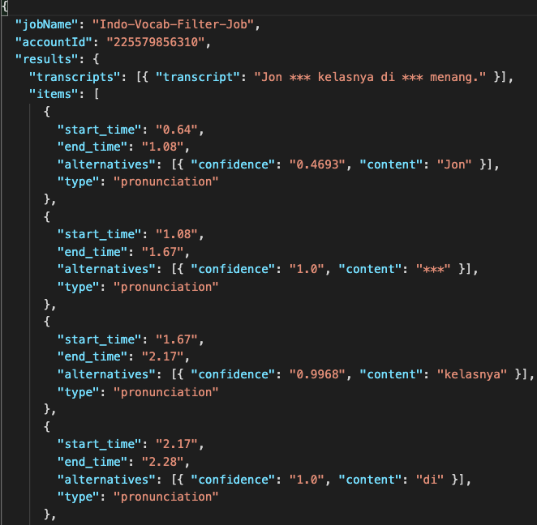

the original transcript should be `Jon mewakili kelasnya di pertandingan renang`. The word `mewakili` and `pertandingan` has been censored.

[BACK TO WORKSHOP GUIDE :house:](../README.md)

[CONTINUE TO NEXT GUIDE :arrow_right:](SpeakerIdentify.md)

[BACK TO PREVIOUS GUIDE :arrow_left:](CustomVocab.md)